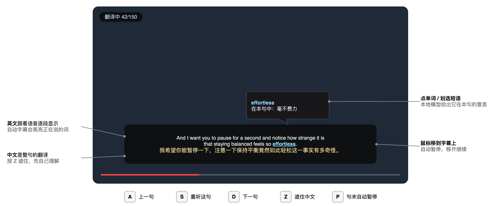
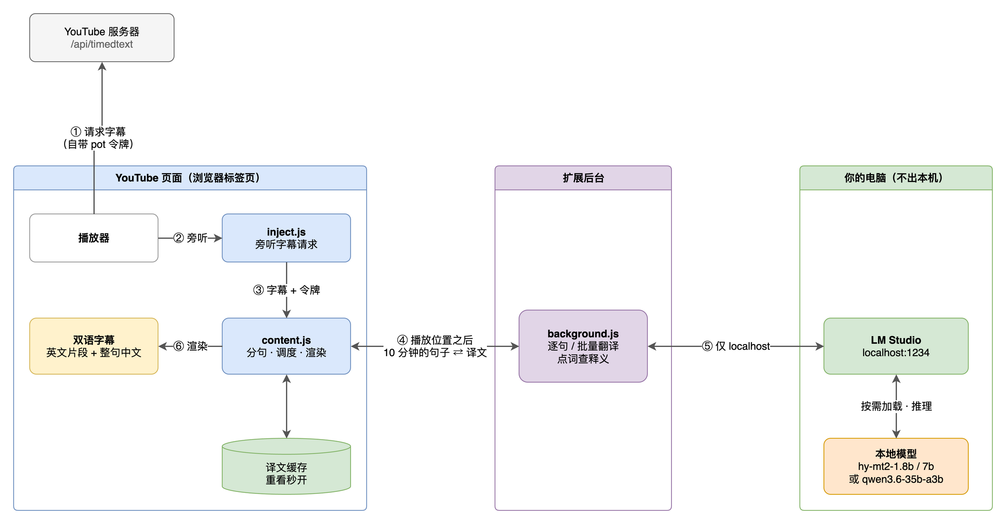
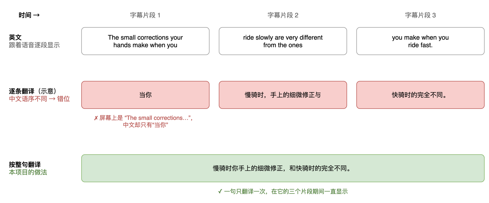
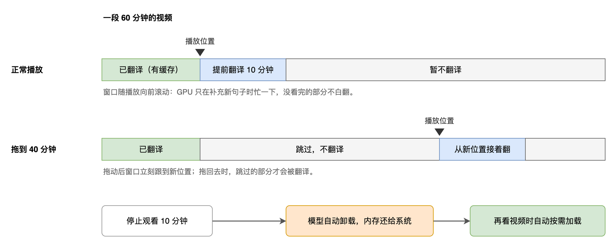
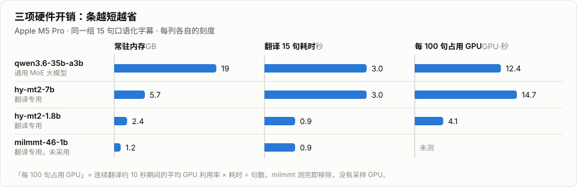
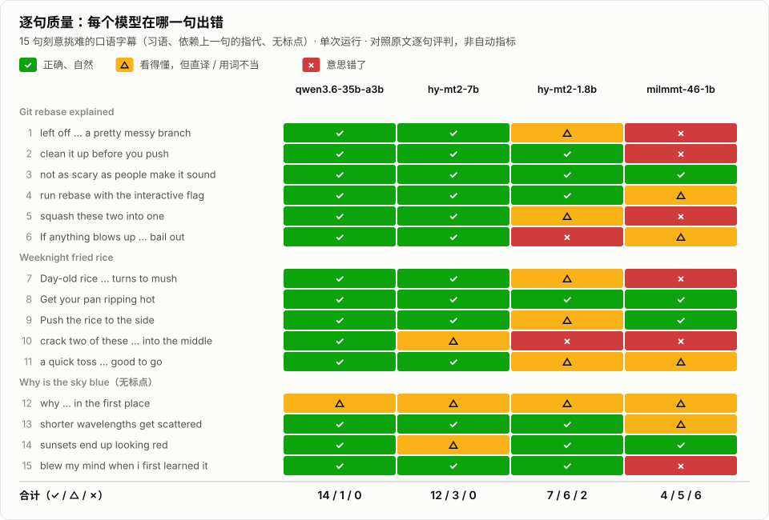

# YT Dual Subs · 本地双语字幕

> A Chrome extension that puts **English + Chinese subtitles on YouTube**, translated on your own machine by a
> local LLM (LM Studio / Ollama), with tools for learning from them: hover to pause, click a word for its meaning
> in context, step sentence by sentence. No API key; nothing leaves your computer.

看 YouTube 时，用**你自己电脑上的模型**把英文字幕译成中文、中英对照显示，并带一套学英语用的交互。
不需要 API key，内容不出本机。

<p align="center">
  
</p>

图中的译文和查词结果是 `hy-mt2-1.8b`（一个只占约 2.4 GB 内存的翻译模型）的真实输出。

## 安装

1. 在 [LM Studio](https://lmstudio.ai) 里准备模型并打开本地服务：
   ```bash
   lms get "https://huggingface.co/tencent/Hy-MT2-1.8B-GGUF@q8_0"
   ```
   ```bash
   lms server start
   ```
   Hugging Face 慢的话，同一份文件[魔搭](https://modelscope.cn/models/Tencent-Hunyuan/Hy-MT2-1.8B-GGUF)也有，下载后放进 `~/.lmstudio/models/tencent/Hy-MT2-1.8B-GGUF/`。
   服务开着就行，模型由扩展按需加载、闲置后自动卸载。
2. Chrome 打开 `chrome://extensions` → 开启**开发者模式** → **加载已解压的扩展程序** → 选本目录。
3. 打开（或刷新）一个 YouTube 视频，字幕随即出现。点工具栏图标看连接状态、翻译进度和全部设置。

用 Ollama：服务地址改成 `http://localhost:11434/v1`，并设置 `OLLAMA_ORIGINS=chrome-extension://*`。

## 它是怎么做的

### 1. 读字幕轨，不做语音识别

<p align="center">
  
</p>

YouTube 几乎所有英文视频都有字幕轨（人工或自动生成），直接用它，时间轴精准、没有延迟，还能**在你看到之前就翻好**。
难点是字幕接口现在要求播放器自己生成的令牌，直接请求只会得到空内容；所以扩展旁听播放器自己的那次请求，借它的令牌取想要的字幕轨。

### 2. 英文逐段显示，中文按整句翻译

<p align="center">
  
</p>

一句话常被切成几条字幕。逐条翻译时，模型会因为中英文语序不同把内容在行间挪动，译文就和屏幕上的英文对不上了——对照学习时这是硬伤。
所以**显示单位**和**翻译单位**分开：英文按短片段跟着语音走，中文按完整句子翻译一次，在这句话的所有片段期间保持显示。

### 3. 只提前翻一小段，闲了就卸载模型

<p align="center">
  
</p>

GPU 只在补充新句子时忙一下，没看完的视频不白翻，翻过的句子进缓存、重看不再占用模型。两个时长都可以在设置里改。

## 学习功能

| 操作 | 作用 |
| --- | --- |
| 鼠标移到字幕上 | 自动暂停，移开继续 |
| 点单词 / 划选短语 | 本地模型给出它**在本句中的意思**（通用大模型还会给音标、词性和用法） |
| `A` / `D` · `S` | 上一句 / 下一句 · 重听当前句 |
| `Z` | 遮住中文，悬停才显示——先自己理解，再对答案 |
| `P` | 每句末自动暂停，适合跟读 |

自动生成的字幕带逐词时间戳，会高亮正在说的那个词。

## 选哪个模型

同一组 15 句口语化字幕，在 Apple M5 Pro 上的实测：

<picture>
  <source media="(prefers-color-scheme: dark)" srcset="docs/charts/resources-dark.svg">
  
</picture>

<picture>
  <source media="(prefers-color-scheme: dark)" srcset="docs/charts/quality-dark.svg">
  
</picture>

| 你最在意的 | 选 | 代价 |
| --- | --- | --- |
| 内存、发热、耗电都要省 | [`hy-mt2-1.8b`](https://huggingface.co/tencent/Hy-MT2-1.8B-GGUF)（默认） | 习语和短语动词多数直译：*blows up* →「爆炸了」 |
| 译文质量，同时省内存 | [`hy-mt2-7b`](https://huggingface.co/tencent/Hy-MT2-7B-GGUF) | 不省 GPU：7B 稠密模型比只激活 3B 的 MoE 算得还多 |
| 最口语的译文 + 完整的查词释义 | `qwen3.6-35b-a3b` | 约 19 GB 内存 |

- 质量图是对照原文逐句评判的结果（单次运行、15 句刻意挑难的句子），用来看**各模型错在哪一类**，不是排行榜。
  每一句的原文、四个译文和分析都在 [docs/model-comparison.md](docs/model-comparison.md)。
- **没有采用 [MiLMMT-46](https://huggingface.co/xiaomi-research/MiLMMT-46-1B-v1.0)**（更新、更小）：它的提示词格式里没有放上文的位置，
  而字幕恰恰是离了上下文就没法翻的碎句——*push* 成了「推车」，*day-old rice* 成了「新鲜的米」。这类意思反了的错误，学习者对照英文也发现不了。
- 「模型」设为自动时：用已经在内存里的 → 否则参数量最小的翻译专用模型 → 否则列表第一个。
- 两类模型的驱动方式不同，扩展按模型名自动切换：通用大模型是**编号批量**翻译（带系统提示词，并用 `reasoning_effort: "none"` 关掉思考）；
  翻译专用模型只认官方的几种提示词格式，所以**一次一句**、4 路并发，把视频标题和前两句放进官方模板的「背景信息」栏。
- 想用小模型翻译、大模型查词：在设置里单独指定「查词用的模型」，并关掉 LM Studio 的 *Auto-Evict for JIT loaded models*（否则两个模型会互相顶掉）。

## 已知限制

- 视频完全没有字幕轨、或是直播时无法工作。覆盖这种情况得走「系统音频 → 语音识别 → 翻译」，是另一套东西。
- 为了拿到令牌，扩展会替你打开播放器的 CC（原生字幕被隐藏，由本扩展的字幕取代）。关掉扩展后按 `C` 可关闭原生字幕。
- YouTube 改版可能让字幕抓取失效。出问题时播放器左上角会提示；先试试手动点一下 CC 按钮。

## 开发

```bash
npm test                                        # 分句、提示词、解析、自动选模型的单元测试
npm run test:llm                                # 用真实的后台代码对本地模型跑翻译和查词（MODEL=<id> 指定模型）
GPU=1 npm run bench -- hy-mt2-1.8b hy-mt2-7b    # 多个模型并排对比译文 + 计时 + GPU 占用（macOS）
npm run harness                                 # 模拟播放器页面，加载未修改的扩展源码
node scripts/make-charts.mjs                    # 由 docs/charts/data.json 重新生成上面两张图表
./scripts/export-diagrams.sh                    # 重新生成并导出 draw.io 示意图
```

| 文件 | 作用 |
| --- | --- |
| `src/inject.js` | 页面主世界：旁听播放器的字幕请求，按指令切换字幕轨 |
| `src/segment.js` | json3 字幕 → 显示片段（cue）与翻译句组（group） |
| `src/content.js` | 会话生命周期、提前翻译调度、缓存、字幕层、快捷键、查词弹窗 |
| `src/background.js` | 调本地模型（流式）、模型发现、冷启动处理 |
| `src/translate-core.js` | 两套提示词、译文解析、自动选模型 |
| `src/popup.*` | 状态与设置 |
| `docs/diagrams/*.drawio` | 示意图源文件；同名 `.drawio.png` 内嵌了源数据，拖进 [draw.io](https://app.diagrams.net) 即可继续编辑 |

## License

[MIT](LICENSE)。本项目与 YouTube / Google 无关；字幕内容的版权归各视频作者所有，扩展只在你的浏览器本地处理它们。
